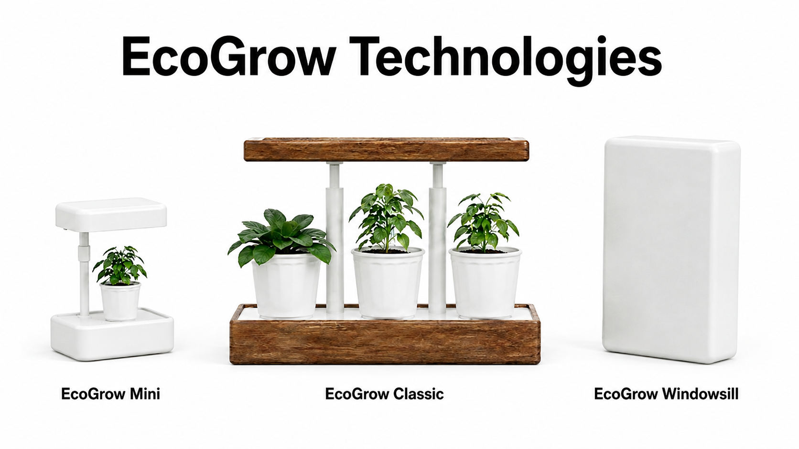
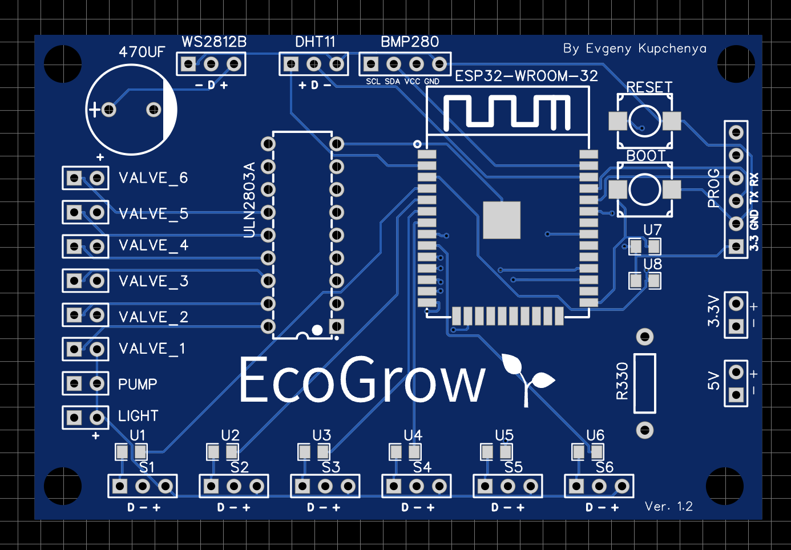
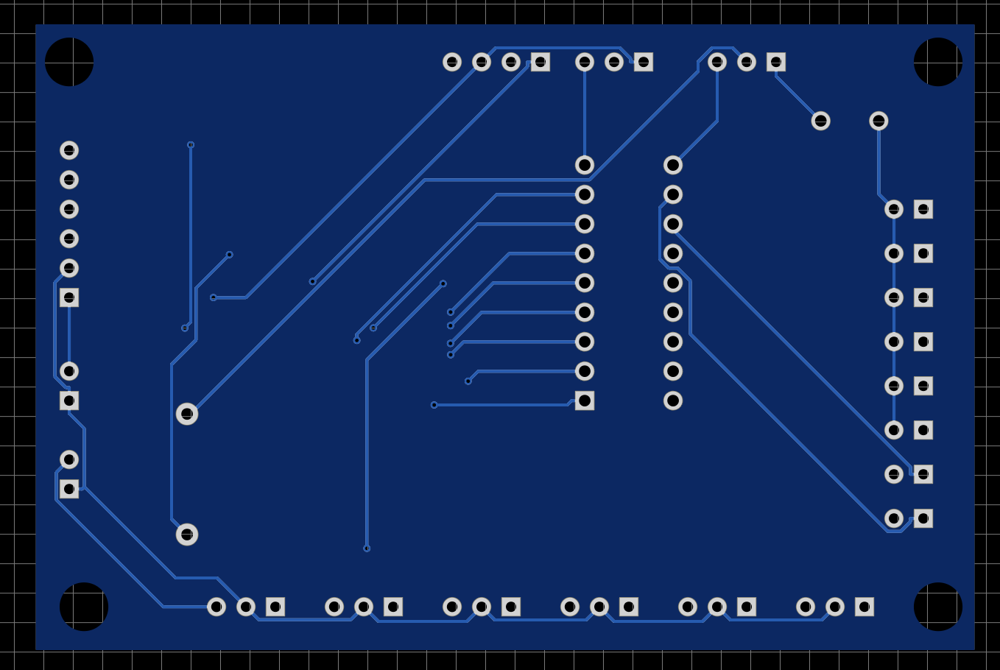
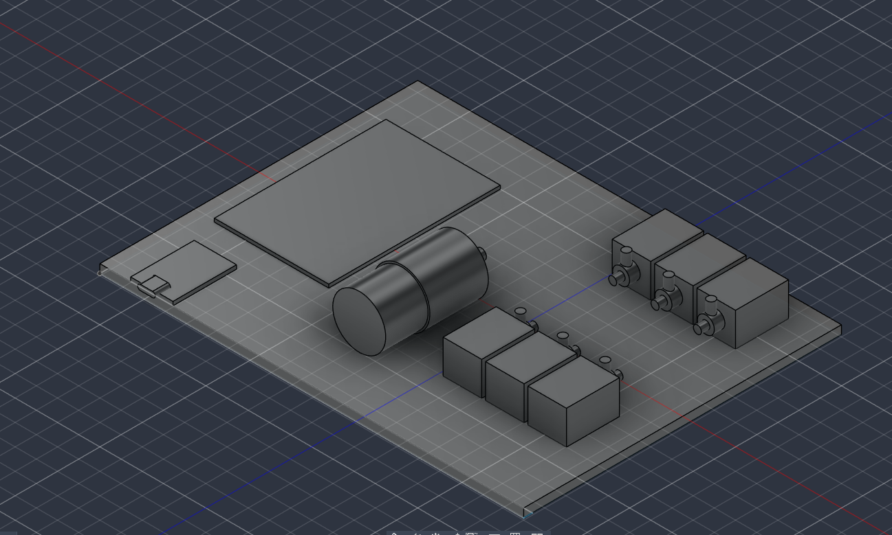

# 🌱 EcoGrow Technologies

> **Умный полив и микроклимат под контролем.**  
> *Компоненты и платы уже заказаны и находятся в пути!*

---

## 📌 Текущий статус

Проект активно разрабатывается. **Компоненты и платы уже едут** – осталось дождаться доставки, чтобы приступить к сборке и отладке.

**Что сделано:**
- Разработана архитектура системы.
- Выбраны все основные компоненты.
- Начато проектирование веб-панели и прошивки для ESP32.

**Что в ближайших планах:**
- Получение посылки с ESP32, датчиками, насосами и реле.
- Сборка макета и написание прошивки.
- Разработка корпусов для устройств (3D-печать) – уже начато 3D-моделирование, однако из-за отсутствия точных размеров компонентов возникли сложности с геометрией, поэтому мы ожидаем посылку, чтобы снять реальные мерки и доработать модель.
- Создание веб-интерфейса для управления системой.

---

## 🧩 Планируемое железо

**Контроллер:** ESP32 WROOM 32  
**Датчики и исполнительные устройства:**
- Датчик температуры и влажности воздуха (DHT11)
- Барометр (BMP280)
- Ёмкостные датчики влажности почвы
- Помпы и электроклапаны 
- LED-лента (WS2812B)

Корпуса будут спроектированы и напечатаны на 3D-принтере после получения всех компонентов.

---

## 📸 Фото будущих плат

Вы можете увидеть фото плат с лицевой и обратной стороны:

---

## 📐 3D-модели корпусов (в разработке)

На данный момент уже разработаны наброски корпусов. Я использую Fusion 360 для моделирования, но точная геометрия будет уточнена после получения физических компонентов – пока нет возможности снять реальные размеры.

Как только посылка прибудет, мы:
- Снимем точные мерки с каждой платы и датчика.
- Доработаем модели с учётом посадочных мест, креплений и вентиляции.
- Напечатаем первые прототипы на 3D-принтере.

Ниже вы можете увидеть текущие наброски:

---

## 📅 Дорожная карта

1. **Получение компонентов** – ожидается в ближайшие дни.
2. **Сборка макета** – проверка работы датчиков и исполнительных устройств.
3. **Разработка прошивки** – чтение данных, управление нагрузкой, передача по Wi-Fi.
4. **Создание 3D-корпусов** – проектирование и печать.
5. **Разработка веб-панели** – интерфейс для управления и мониторинга.
6. **Интеграция и тестирование** – связка ESP32 + веб-панель.
7. **Публикация проекта** – открытый исходный код и документация.

---

## 📬 Контакты

- **Telegram:** [@Zhesny](https://t.me/Zhesny)
- **Email:** zhenya.kupchenya@mail.ru

---

> *Ждём посылку и готовимся к сборке!*  
> 🌿 **EcoGrow Technologies**
